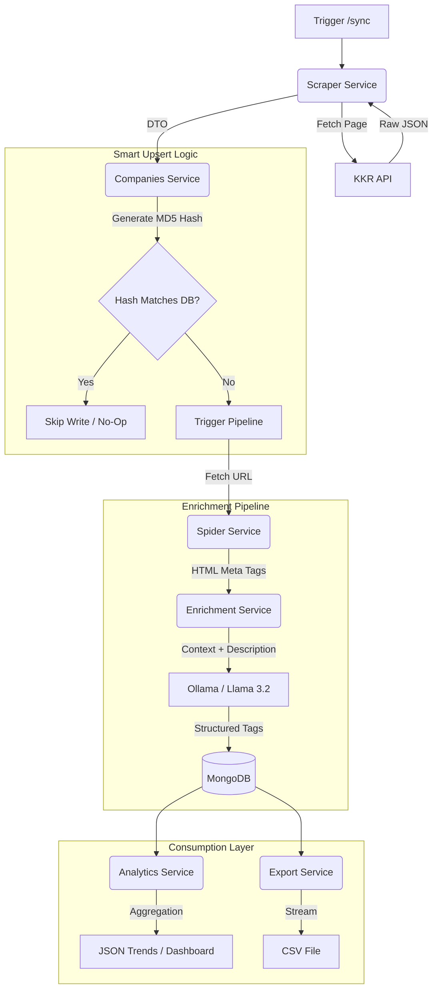

# Technical Architecture & Design Decisions

## System Overview
The application follows a **Modular Monolith** architecture using **NestJS**. It adheres to **Domain-Driven Design (DDD)** principles, separating concerns into distinct modules (Scraper, Spider, Enrichment, Storage, Analytics).

### High-Level Data Flow

## Key Design Patterns

### 1. Strategy Pattern (AI Enrichment)
*   **Problem:** We needed to switch between a powerful AI model (Llama 3.2) and a fast, offline keyword extractor without modifying the business logic.
*   **Solution:** defined an `IEnrichmentStrategy` interface.
    *   `OllamaStrategy`: Connects to local LLM inference.
    *   `RegexStrategy`: Uses deterministic keyword matching.
    *   The `EnrichmentService` acts as a Factory, selecting the strategy at runtime based on the `ENABLE_LLM` environment variable.

### 2. Repository Pattern (Abstracted)
*   **Problem:** Tightly coupling controllers to Mongoose models makes testing hard and logic messy.
*   **Solution:** `CompaniesService` encapsulates all data access logic. It handles the "Smart Upsert" complexity, exposing simple methods (`createOrUpdate`, `search`) to the rest of the application.

### 3. Circuit Breaker & Retry
*   **Problem:** External websites are unreliable. A single timeout shouldn't crash the pipeline, but repeated failures indicate a block.
*   **Solution:**
    *   **Retry:** Exponential Backoff (2s -> 4s -> 8s) for transient network glitches.
    *   **Circuit Breaker:** If 3 consecutive pages fail, the job aborts to prevent logging noise and IP flagging.

### 4. Analytics & Aggregation Engine
*   **Problem:** Raw data is hard to interpret. Investors need to visualize **Trends over Time** (e.g., "Is KKR shifting focus from Energy to Tech?").
*   **Solution:** We leverage MongoDB's **Aggregation Framework** to compute statistics on the fly (Read-Time Aggregation).
*   **Capabilities:**
    *   **Distribution:** Breakdown by Industry, Region, and AI-Generated Tags.
    *   **Multi-Dimensional Trends:** Uses compound grouping (`{ year, industry }`) to generate time-series data suitable for Heatmaps and Stacked Bar Charts.
    *   **Performance:** All calculations are offloaded to the Database Engine (C++), minimizing the memory footprint of the Node.js application.

### 5. Data Export Strategy
*   **Format:** CSV (Comma Separated Values).
*   **Implementation:** The system flattens the nested JSON documents (including AI analysis) into tabular format using `json2csv`.
*   **Stream Handling:** The resulting CSV is piped directly to the HTTP Response stream with `Content-Disposition: attachment`, allowing immediate integration with external tools like Excel, Tableau, or PowerBI.

---

## Architectural Trade-offs

### 1. Serial vs. Batch Processing
*   **Decision:** We process records serially (one by one) rather than using `bulkWrite`.
*   **Context:** The dataset is small (~300-500 companies).
*   **Rationale:**
    *   **Pros:** Granular error handling. If Company #5 fails (e.g., website timeout), we catch it, log it, and move to Company #6 without rolling back the whole batch.
    *   **Cons:** Higher DB round-trips (N+1 problem).
    *   **Scaling Strategy:** If the dataset grows >10,000 records, we would refactor to use MongoDB `bulkWrite` operations and a message queue (RabbitMQ/Redis) for parallel processing. For the current scope, Serial is safer and easier to debug.

### 2. Embedded Documents vs. Relational Tables
*   **Decision:** Storing `aiAnalysis` and `websiteData` as embedded objects within the `Company` document.
*   **Rationale:** MongoDB is a Document Store. Data that is *accessed together* should be *stored together*. We almost always want to see the Tags when viewing the Company. Joining separate collections would add unnecessary latency.

### 3. Local LLM (Ollama) vs. Cloud API (OpenAI)
*   **Decision:** Using Ollama (Local).
*   **Rationale:**
    *   **Privacy:** Financial data often requires strict data governance. Processing locally ensures no data leaves the infrastructure.
    *   **Cost:** Zero marginal cost per run.
    *   **Development Speed:** No API keys or credit card limits to manage during development.

---

## Technology Stack Rationale

*   **NestJS:** Chosen for its strict dependency injection system and TypeScript support, making the codebase maintainable and enterprise-ready.
*   **MongoDB:** Selected over SQL because scraped data is semi-structured. Some companies lack "Year of Investment" or "Logo"; a NoSQL schema handles this variability gracefully.
*   **Cheerio:** Used for HTML parsing. It is significantly faster and lighter (RAM) than Puppeteer/Playwright because it parses static HTML without executing JavaScript. Since KKR provides a JSON API, full browser automation was unnecessary overhead.